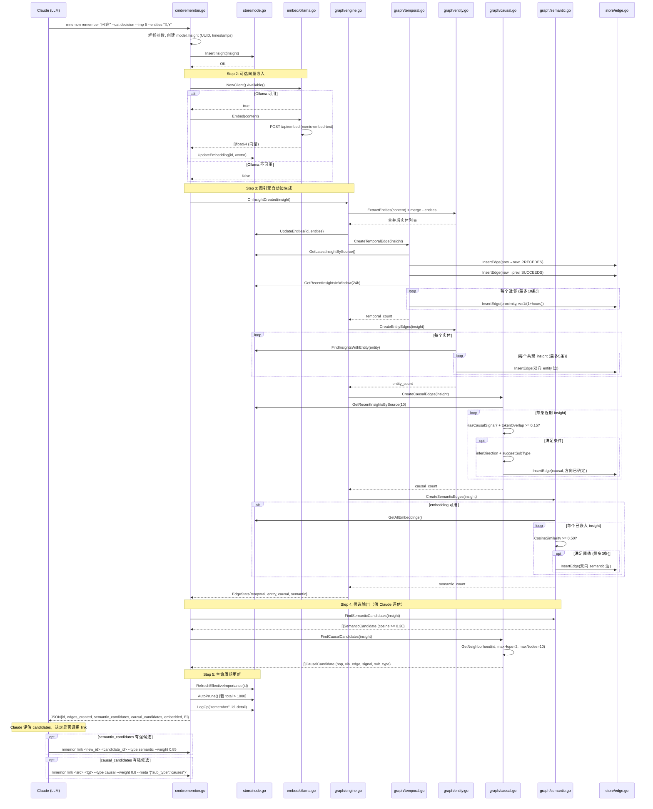
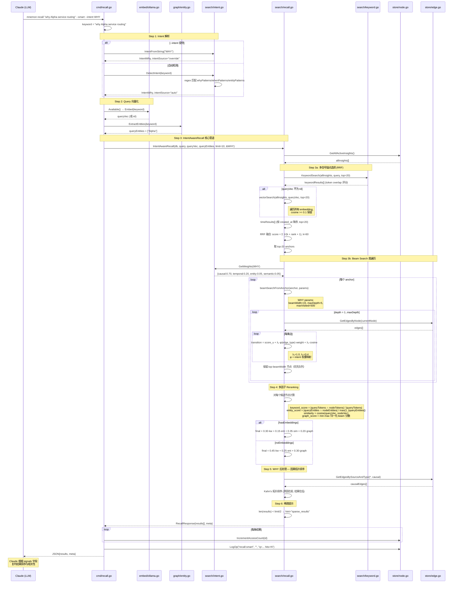
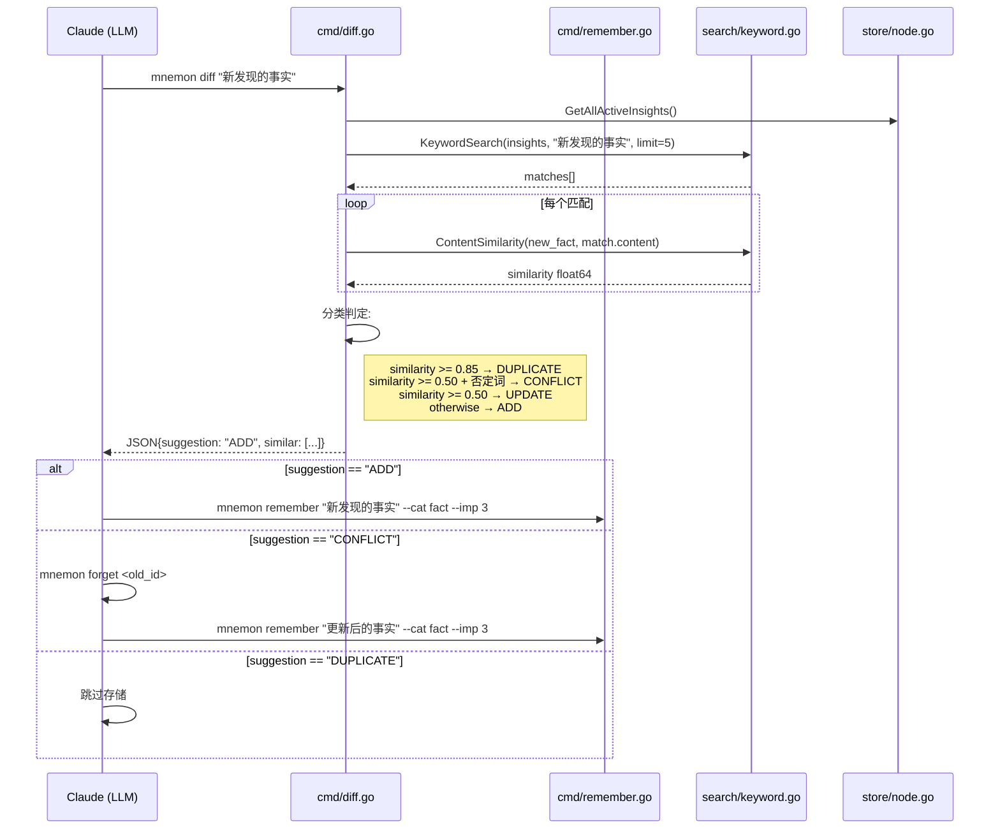
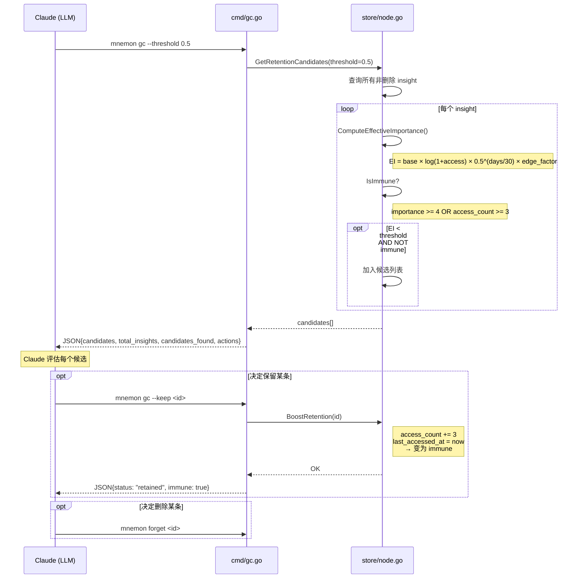
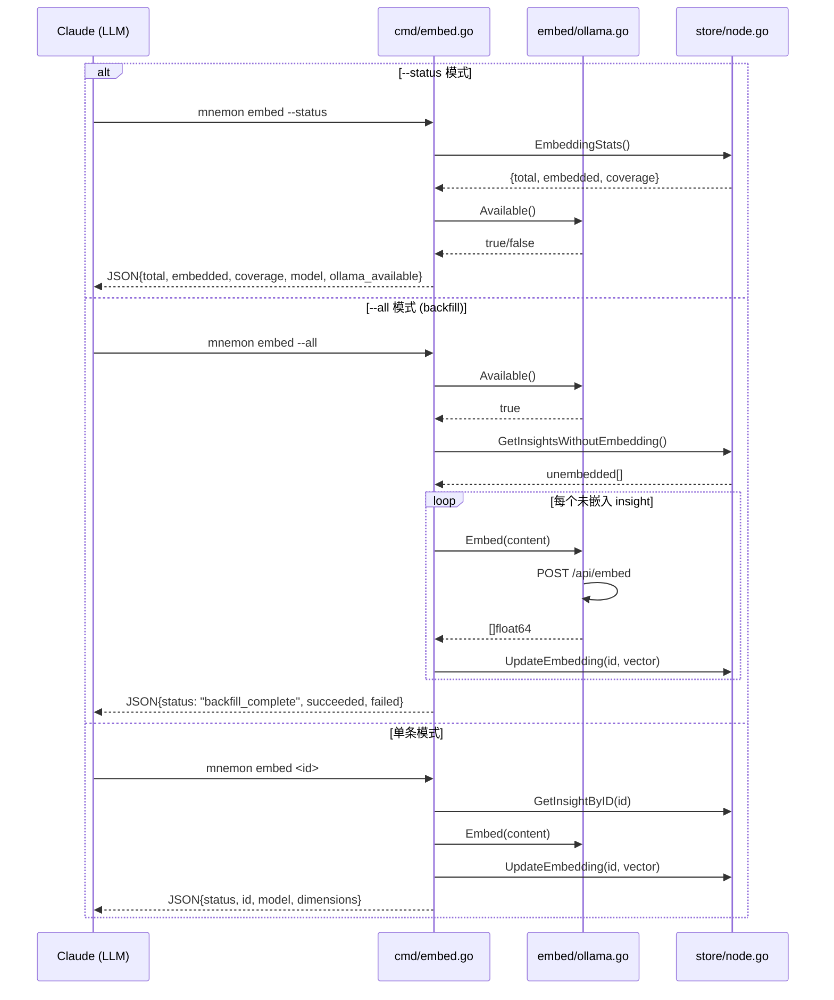
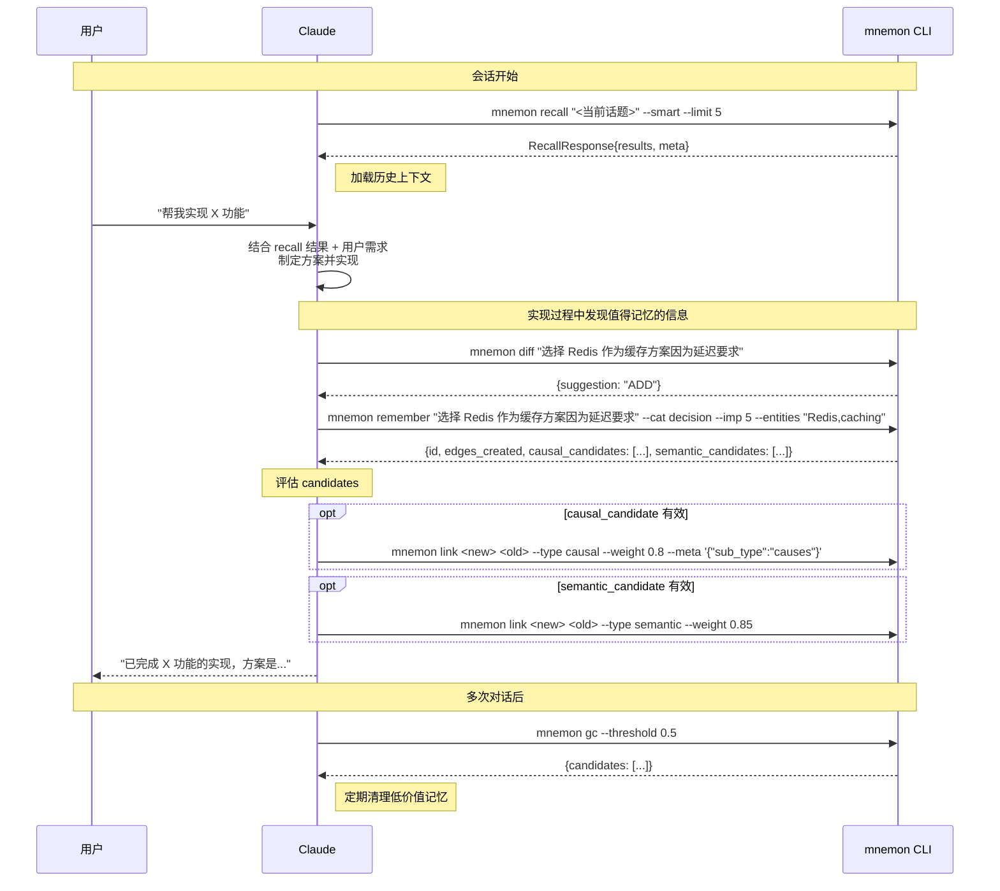

# 2. 典型场景时序图

## 2.1 场景一：Remember（存储新记忆）

完整的写入管道：从 Claude 调用 `mnemon remember` 到图边自动生成、候选输出。



### 数据库状态变化

| 步骤 | insights 表 | edges 表 | oplog 表 |
|------|-------------|----------|----------|
| InsertInsight | +1 行 | — | — |
| UpdateEmbedding | embedding 列更新 | — | — |
| UpdateEntities | entities 列更新 | — | — |
| CreateTemporalEdge | — | +2 (backbone) + N (proximity) | — |
| CreateEntityEdges | — | +2×M (双向共现) | — |
| CreateCausalEdges | — | +K (因果) | — |
| CreateSemanticEdges | — | +2×L (双向语义) | — |
| LogOp | — | — | +1 |
| link (Claude 手动) | — | +2 (双向) | +1 |

## 2.2 场景二：Smart Recall（智能召回）

完整的读取管道：从查询到多信号锚点选择、beam search、多因子 reranking。



### 数据库状态变化

| 步骤 | insights 表 | edges 表 | oplog 表 |
|------|-------------|----------|----------|
| GetAllActiveInsights | 读（全表扫描，排除 deleted_at） | — | — |
| GetEdgesByNode | — | 读（按 source_id/target_id 索引） | — |
| IncrementAccessCount | access_count +1, last_accessed_at 更新 | — | — |
| LogOp | — | — | +1 |

## 2.3 场景三：Diff + Remember 组合（去重后存储）

Claude 的标准记忆存储流程：先 diff 检查重复，再决定存储。



## 2.4 场景四：GC 生命周期管理



## 2.5 场景五：Link（手动边创建）

Claude 评估 candidates 后手动建边的流程。

```mermaid
sequenceDiagram
    participant C as Claude (LLM)
    participant LINK as cmd/link.go
    participant S as store/node.go
    participant SE as store/edge.go

    Note over C: remember 输出中<br/>causal_candidates[0].suggested_sub_type = "causes"

    C->>LINK: mnemon link <src> <tgt> --type causal --weight 0.8 --meta '{"sub_type":"causes","reason":"..."}'

    LINK->>LINK: 验证 edge_type ∈ {temporal, semantic, causal, entity}
    LINK->>LINK: 验证 weight ∈ [0.0, 1.0]

    LINK->>S: GetInsightByID(src)
    S-->>LINK: srcInsight (或 error)
    LINK->>S: GetInsightByID(tgt)
    S-->>LINK: tgtInsight (或 error)

    LINK->>LINK: metadata.created_by = "claude"

    LINK->>SE: InsertEdge(src→tgt, causal, 0.8, metadata)
    Note right of SE: INSERT OR REPLACE<br/>(允许更新已有边的权重)
    LINK->>SE: InsertEdge(tgt→src, causal, 0.8, metadata)

    LINK->>S: LogOp("link", src, "src→tgt causal w=0.8")

    LINK-->>C: JSON{status: "linked", source_id, target_id, edge_type, weight}
```

## 2.6 场景六：Embed（向量嵌入管理）



## 2.7 端到端典型会话流程

一个完整的 Claude 使用 mnemon 的会话流程：


